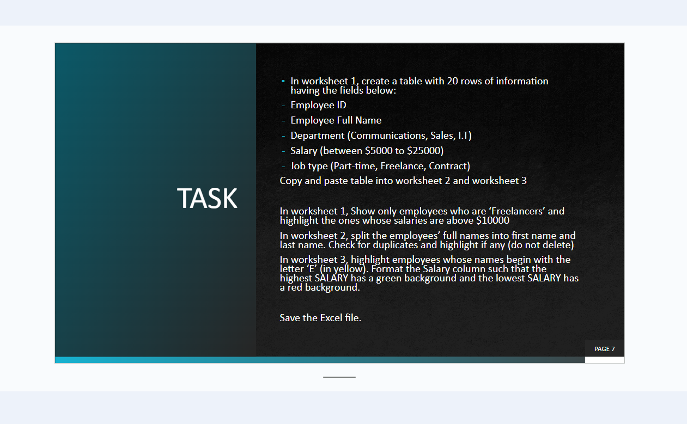
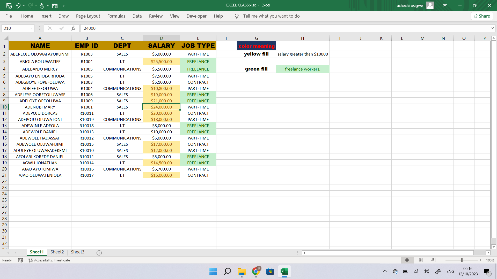
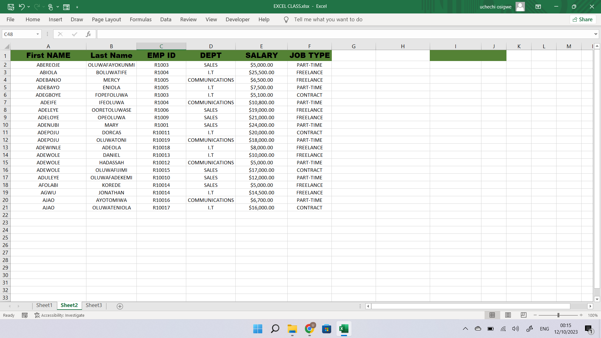
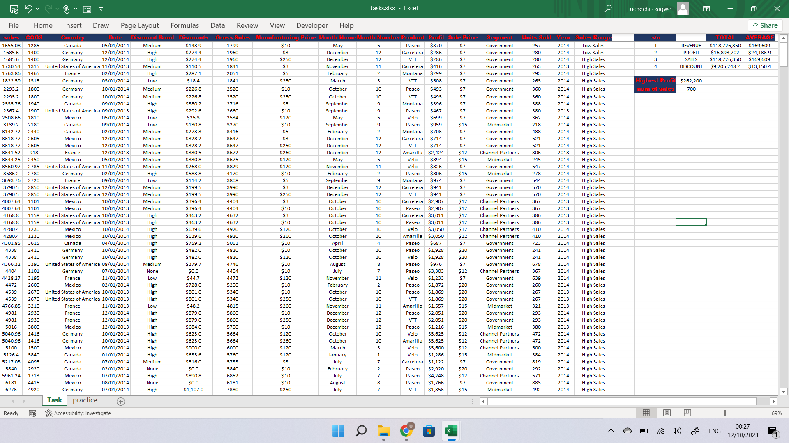

# Task

### Project Overview
This is an excel practice task given to solidify my knowledge in what was taught. it contains 4 sheets with 21 & 701 rows od data respectively

### Data sources
two datasets were used in these tasks
- Data 1  is an imaginary one created by me for the purpose of this task, the headers were already given so i filled the infomation with dummy data from my head.
- Data 2 was downloaded online from our class materials

### Tools
- Excel : Data cleaning and Manipulation
  
### Data preparation
in the initial preparation, i performed the following
- Data creation / loading
- Data inspection and handling missing values 
- Data cleaning and formatting

## Tasks
###TASK 1

### Task 1 A
i used conditional formatting to highlight employees who are _freelancers_ and those whose salary are above _$10000_.

### Task 1 B
i split the name colume into first and last name using the **Text to column** in the data tab.

### Task 1 C 
i highlighted employees whose name started with "E" with color yellow using a formular pasted in the conditional formatting tab.

![]task_1num3.png)

## Task 2

 i used the sales data to calulate the total and average of some rows, i also used the _IF_ funtion to create a new column that returned High or low sales when a value is greater or less than the **Average** of the sales column.
 
 

 ## RESULTS

 this task was done to show that i understood and grabbed the skills taught. these tasks can be viewed [here](https://1drv.ms/x/s!AsoxWuo56Q7wgU80-wsbdxezSefU) & [here](https://1drv.ms/x/s!AsoxWuo56Q7wgVTYoX0UXzQclSJ7), Thank you.
